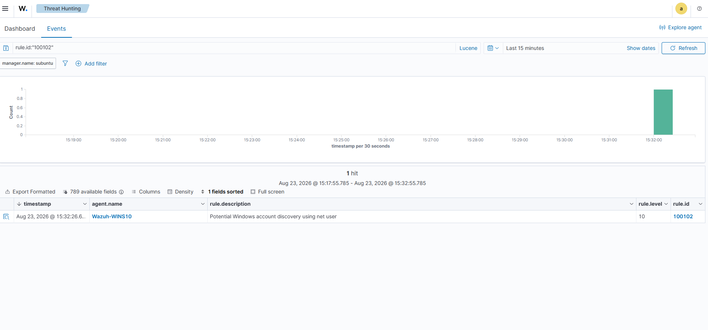
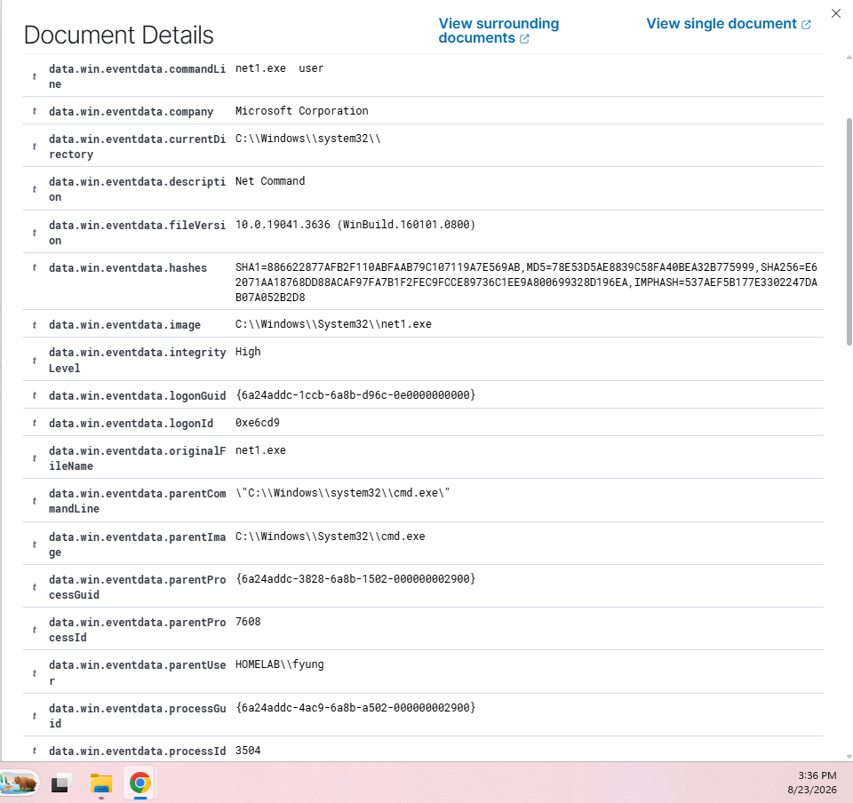
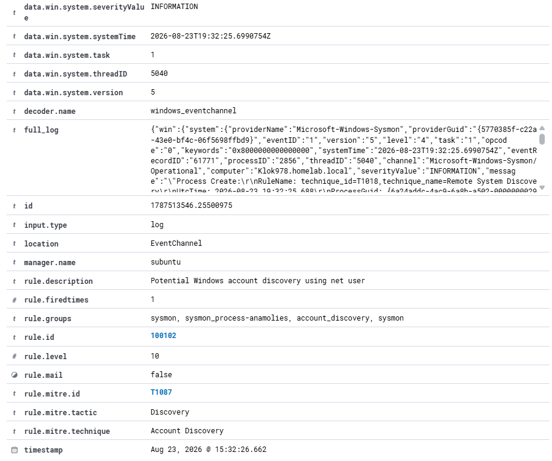
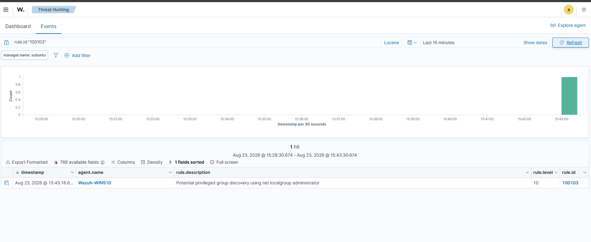
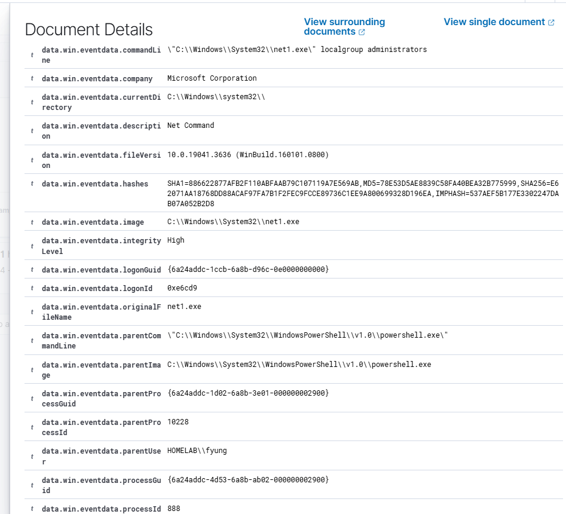
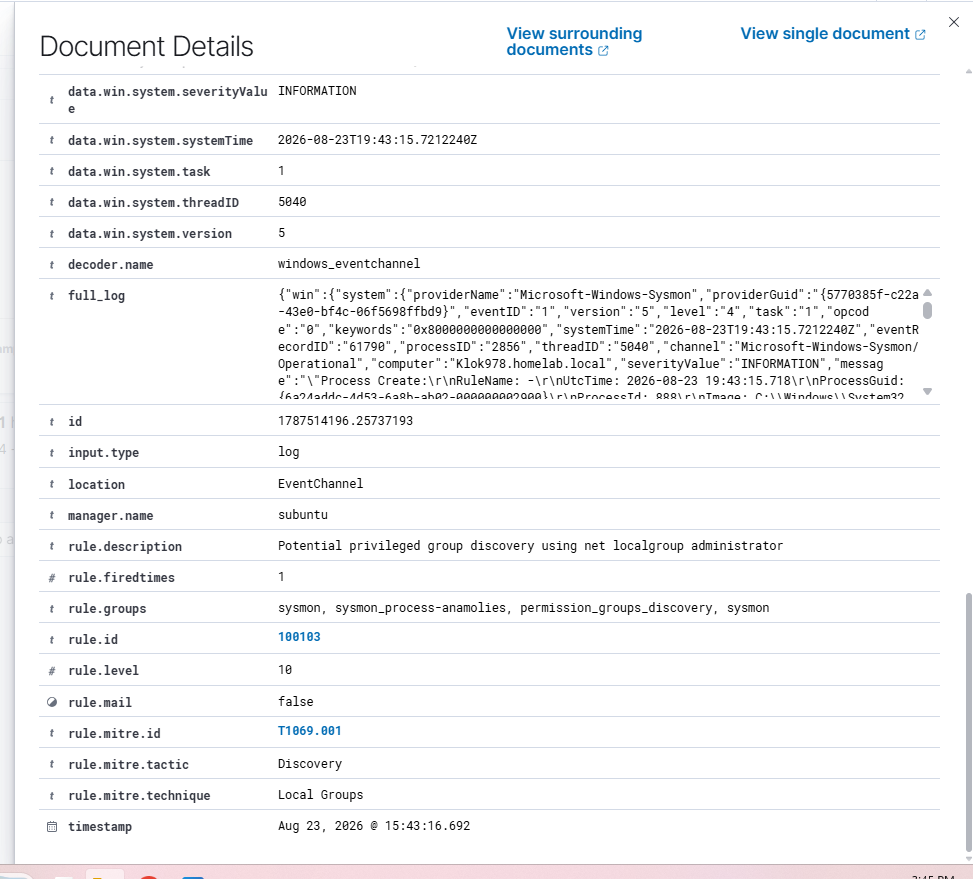

# Wazuh Detection Engineering Lab

## Overview

This project documents a hands-on detection engineering and SOC analysis lab built using Wazuh, Sysmon, Windows Event Logging, PowerShell logging, and Active Directory.

The goal of this project was not only to generate security alerts, but to understand the telemetry behind them, create custom detections, test those detections for weaknesses, and tune them to improve coverage.

During the lab, I:

- Configured Windows endpoints to send security telemetry to Wazuh.
- Used Sysmon to monitor process activity.
- Enabled PowerShell Script Block Logging.
- Investigated Windows authentication and process-related alerts.
- Created custom Wazuh detection rules.
- Mapped detections to MITRE ATT&CK techniques.
- Tested detection rules against different execution methods.
- Identified and corrected detection gaps.
- Performed false-positive analysis and detection tuning.

## Lab Environment

| Component | Purpose |
|---|---|
| Wazuh | SIEM, log analysis, alerting, and threat hunting |
| Sysmon | Enhanced Windows endpoint telemetry |
| Windows 10 | Monitored endpoint |
| Windows Server | Active Directory Domain Controller |
| PowerShell | Administration and controlled activity generation |
| Proxmox | Virtualization platform |
| MITRE ATT&CK | Detection technique mapping |

## Project Objectives

The primary objectives were to:

1. Collect Windows security telemetry in Wazuh.
2. Investigate endpoint and authentication events.
3. Understand process relationships using Sysmon.
4. Develop custom behavioral detection rules.
5. Test detections for false negatives and bypasses.
6. Tune detections based on testing results.
7. Map detections to the MITRE ATT&CK framework.

## Custom Detections

Two primary custom detections were developed during the project.

### Rule 100102 — Windows Account Discovery

Detects account discovery performed using `net.exe` or `net1.exe`.

**MITRE ATT&CK:** T1087 — Account Discovery

Examples detected:

```text
net user
net.exe user
NET USER
net1.exe user
net user administrator
```

### Rule 100103 — Privileged Group Discovery

Detects enumeration of the local Administrators group using `net.exe` or `net1.exe`.

**MITRE ATT&CK:** T1069.001 — Permission Groups Discovery: Local Groups

Examples detected:

```text
net localgroup administrators
net.exe localgroup administrators
net1.exe localgroup administrators
NET LOCALGROUP ADMINISTRATORS
```

The original version of this rule required `powershell.exe` to be the parent process. Testing revealed that executing the same discovery command from Command Prompt bypassed the detection.

To improve coverage, the PowerShell parent-process requirement was removed so the rule focuses on the discovery behavior rather than the shell used to execute it.

Additional testing showed that `net1.exe` could also bypass the original detection. The image-matching logic was updated to detect both `net.exe` and `net1.exe`.

The final rule was successfully tested from both PowerShell and Command Prompt.

## Detection Engineering Process

The detections were developed using an iterative process:

**Generate Activity → Analyze Telemetry → Build Detection → Test → Identify Gaps → Tune → Retest**

Testing the custom rules revealed multiple detection gaps that were corrected through rule tuning:

- **Shell dependency:** The original rules relied on `powershell.exe` as the parent process, allowing the same discovery activity executed through Command Prompt to bypass detection.
- **Executable variation:** The original rules detected `net.exe`, but testing showed that `net1.exe` could perform the same discovery activity without triggering the detection.
- **Case variation:** Commands were tested using variations such as `net user`, `NET USER`, and `net1.exe USER`.
- **Negative testing:** Unrelated commands such as `net start` were tested to confirm that the account discovery rule did not trigger on all `net.exe` activity.

The final detections focus more on the discovery behavior itself rather than a specific shell or executable variation.

### Rule 100102 — Account Discovery

The final account discovery rule generated a Level 10 Wazuh alert when account enumeration was performed using `net1.exe`.



The underlying Sysmon telemetry confirmed the execution of `net1.exe user` from Command Prompt. This validated that the final rule was no longer dependent on PowerShell as the parent process.



The resulting alert was mapped to **MITRE ATT&CK T1087 — Account Discovery**.




### Rule 100103 — Privileged Group Discovery

The final privileged group discovery rule successfully detected enumeration of the local Administrators group.



Sysmon process telemetry was used to validate the command execution and process relationship.



The resulting alert was mapped to **MITRE ATT&CK T1069.001 — Permission Groups Discovery: Local Groups**.




## Key Takeaways

This project demonstrated that successfully triggering an alert does not necessarily mean a detection is complete. Effective detection engineering requires testing rules against alternate execution methods, identifying false negatives, evaluating false positives, and tuning detection logic while maintaining useful coverage.

By testing the custom detections from multiple shells and with different Windows utilities, I was able to identify weaknesses in the original rules and improve their resilience.

## Disclaimer

All activity documented in this repository was performed in an isolated home lab environment for educational and defensive security purposes.

Detailed testing methodology and results are available in [Detection Testing & Tuning](docs/detection-testing.md).
